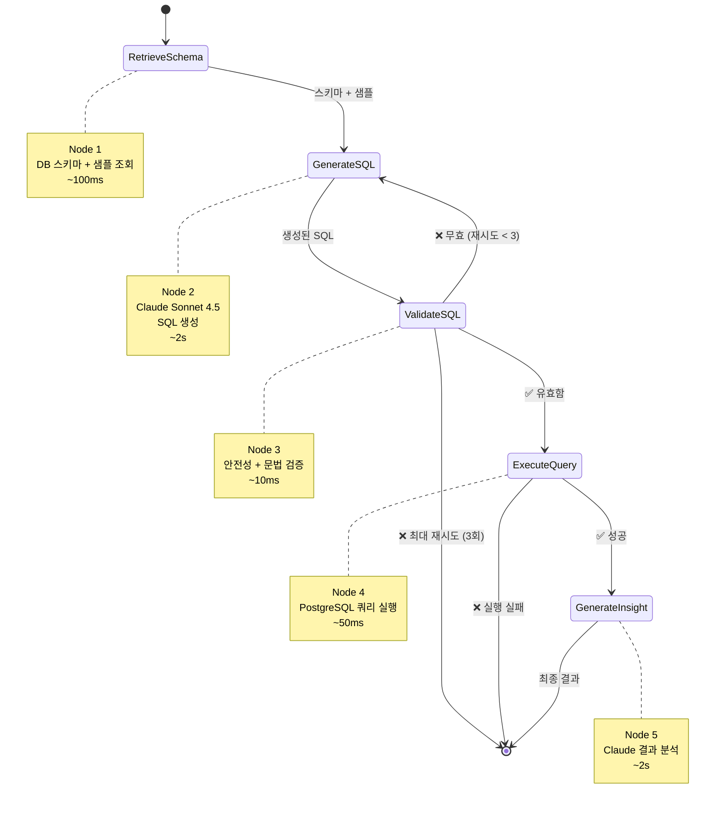

# LangGraph 에이전트 워크플로우

## 개요

log-analysis-server는 **LangGraph 기반 Text-to-SQL 에이전트**를 구현하여 자연어 질문을 SQL 쿼리로 변환하고, PostgreSQL에 대해 실행한 후, Claude Sonnet 4.5를 사용하여 사람이 이해할 수 있는 인사이트를 생성합니다.

### 왜 LangGraph인가?

전통적인 LLM 체인은 순차적이고 디버깅하기 어렵습니다. LangGraph는 다음을 제공합니다:

- **명시적 상태 관리**: 각 노드에서 명확한 상태 전이
- **내장된 에러 복구**: 상태 보존과 함께 자동 재시도 로직
- **쉬운 디버깅**: 워크플로우의 어느 시점에서든 상태 검사 가능
- **확장성**: 핵심 로직 재작성 없이 노드 추가/수정 가능
- **조건부 라우팅**: 검증 결과에 따른 동적 워크플로우

### 주요 기능

- ✅ **자동 SQL 생성**: Claude Sonnet 4.5가 자연어로부터 쿼리 생성
- ✅ **안전성 검증**: 위험한 작업 차단 (INSERT, DELETE, DROP)
- ✅ **자동 재시도**: 검증 실패 시 최대 3회 재시도
- ✅ **결과 분석**: 한국어로 생성되는 AI 인사이트
- ✅ **성능 추적**: 실행 시간 및 결과 통계

---

## 아키텍처 다이어그램



---

## 상태 관리

### AgentState 구조

에이전트는 워크플로우 진행 상황을 추적하기 위해 13개의 필드를 가진 `TypedDict`를 사용합니다:

```python
class AgentState(TypedDict):
    # 입력
    question: str                    # 사용자의 자연어 질문
    max_results: int                 # 반환할 최대 결과 수

    # 스키마 정보
    schema_info: str                 # 데이터베이스 테이블 스키마
    sample_data: str                 # 샘플 로그 데이터 (최근 3개)

    # SQL 생성
    generated_sql: str               # 생성된 SQL 쿼리
    validation_error: str            # 검증 에러 (있을 경우)
    retry_count: int                 # 재시도 횟수

    # 쿼리 실행
    query_results: list              # 원시 쿼리 실행 결과
    execution_time_ms: float         # 쿼리 실행 시간
    error_message: str               # 실행 에러 (있을 경우)

    # 최종 출력
    formatted_results: dict          # 페이지네이션이 적용된 포맷된 결과
    insight: str                     # AI가 생성한 분석

    # 디버그 히스토리
    messages: Annotated[Sequence[dict], add]  # 추가 전용 처리 로그
```

### 상태 전이

각 노드에서 상태는 **불변**입니다. 노드는 업데이트된 필드가 있는 dict를 반환하고 이것이 현재 상태에 병합됩니다. `messages` 필드는 `add` 연산자를 사용하여 추가 전용 로깅을 수행합니다.

**상태 진화 예시**:
```python
# 초기 상태
{"question": "최근 에러 로그", "retry_count": 0, "generated_sql": "", ...}

# retrieve_schema_node 이후
{"schema_info": "Table: logs\nColumns:...", "sample_data": "...", ...}

# generate_sql_node 이후
{"generated_sql": "SELECT * FROM logs WHERE...", ...}

# validate_sql_node 이후 (실패)
{"validation_error": "'deleted = FALSE' 누락", "retry_count": 1, ...}

# generate_sql_node 이후 (재시도)
{"generated_sql": "SELECT * FROM logs WHERE ... AND deleted = FALSE", ...}
```

---

## 노드 구현

### Node 1: retrieve_schema_node

**목적**: SQL 생성을 위한 컨텍스트를 제공하기 위해 데이터베이스 스키마와 샘플 데이터를 가져옵니다.

**입력 상태**:
- `question`: 사용자의 질문 (이 노드에서는 미사용)
- `max_results`: 결과 제한 (이 노드에서는 미사용)

**처리 과정**:
1. asyncpg를 사용하여 PostgreSQL에 연결
2. 테이블 구조를 위해 `information_schema.columns` 쿼리
3. 최근 3개의 로그 가져오기 (WHERE deleted = FALSE)
4. 스키마와 샘플을 문자열로 포맷팅

**출력 상태**:
- `schema_info`: 타입, null 허용 여부, 기본값이 있는 테이블 컬럼
- `sample_data`: 최근 3개 로그 항목 미리보기
- `messages`: 처리 로그 항목

**구현 위치**: `agent/nodes.py:34-88`

**실행 시간**: ~100ms

**출력 예시**:
```
schema_info:
Table: logs
Columns:
  - id: bigint NOT NULL DEFAULT nextval('logs_id_seq'::regclass)
  - created_at: timestamp without time zone NOT NULL
  - level: character varying NOT NULL
  - service: character varying NULL
  - message: text NOT NULL
  - deleted: boolean NOT NULL

sample_data:
Sample Data (Recent 3 logs):
  - [ERROR] payment-api: Connection timeout after 30s...
  - [WARN] user-api: High memory usage detected (85%)...
  - [INFO] order-api: Processing batch job completed...
```

---

### Node 2: generate_sql_node

**목적**: Claude Sonnet 4.5를 사용하여 자연어 질문에서 SQL 쿼리를 생성합니다.

**입력 상태**:
- `question`: 사용자의 자연어 질문
- `schema_info`: Node 1의 데이터베이스 스키마
- `sample_data`: Node 1의 샘플 로그

**LLM 설정**:
- 모델: `claude-sonnet-4-5-20250929`
- Temperature: 0 (결정론적 출력)
- API Key: `ANTHROPIC_API_KEY` 환경 변수에서

**처리 과정**:
1. `SQL_GENERATION_PROMPT` 템플릿을 사용하여 프롬프트 구성
2. 스키마, 샘플, 안전 규칙, 예시 쿼리 포함
3. `langchain_anthropic.ChatAnthropic`을 통해 Claude에 프롬프트 전송
4. 정규식을 사용하여 응답에서 SQL 추출 (코드 블록 처리)

**출력 상태**:
- `generated_sql`: 생성된 SQL 쿼리 문자열
- `messages`: LLM 요청/응답 로그

**구현 위치**: `agent/nodes.py:91-120`

**실행 시간**: ~2초 (LLM API 호출)

**프롬프트 포함 내용**:
- 컬럼 타입이 포함된 데이터베이스 스키마
- 컨텍스트를 위한 샘플 데이터
- 안전 규칙:
  - ✅ SELECT만 허용 (INSERT, UPDATE, DELETE 불가)
  - ✅ `WHERE deleted = FALSE` 필수 포함
  - ✅ 인덱스 사용 (created_at, service, level)
  - ✅ LIMIT 절 추가
- 4개의 예시 쿼리:
  - 에러 로그 쿼리
  - 에러 패턴 분석
  - 사용자 여정 추적
  - 느린 API 감지

**출력 예시**:
```sql
SELECT id, created_at, level, service, message
FROM logs
WHERE level = 'ERROR'
  AND created_at > NOW() - INTERVAL '1 hour'
  AND deleted = FALSE
ORDER BY created_at DESC
LIMIT 100;
```

---

### Node 3: validate_sql_node

**목적**: 생성된 SQL의 안전성과 문법 정확성을 검증합니다.

**입력 상태**:
- `generated_sql`: Node 2의 SQL 쿼리

**처리 과정**:
1. **안전성 검증** (`validate_sql_safety`):
   - ✅ SELECT로 시작해야 함
   - ❌ 위험한 키워드 차단: INSERT, UPDATE, DELETE, DROP, CREATE, ALTER, TRUNCATE, GRANT, REVOKE, EXEC, EXECUTE, DECLARE, CURSOR
   - ✅ `deleted = FALSE` 조건 필수 포함

2. **문법 검증** (`validate_sql_syntax`):
   - `sqlparse.parse()`를 사용하여 SQL 문법 확인
   - 유효한 SELECT 문인지 확인
   - 파싱 에러 확인

**출력 상태**:
- `validation_error`: 에러 메시지 (유효하면 빈 문자열)
- `retry_count`: 검증 실패 시 증가
- `messages`: 검증 결과 로그

**구현 위치**: `agent/nodes.py:123-145`

**실행 시간**: ~10ms (로컬 처리)

**검증 예시**:

✅ **유효한 SQL**:
```sql
SELECT * FROM logs WHERE deleted = FALSE;
```

❌ **무효 - 위험한 작업**:
```sql
DELETE FROM logs WHERE id = 1;
```
→ 에러: "위험한 SQL 작업 감지: DELETE"

❌ **무효 - 소프트 삭제 누락**:
```sql
SELECT * FROM logs WHERE level = 'ERROR';
```
→ 에러: "SQL은 'deleted = FALSE' 조건을 포함해야 합니다"

❌ **무효 - 문법 에러**:
```sql
SELECT * FROM logs WHERE
```
→ 에러: "SQL 문법 에러: 예상치 못한 문 종료"

---

### Node 4: execute_query_node

**목적**: PostgreSQL 데이터베이스에 대해 검증된 SQL 쿼리를 실행합니다.

**입력 상태**:
- `generated_sql`: 검증된 SQL 쿼리
- `max_results`: 반환할 최대 결과 수

**처리 과정**:
1. asyncpg를 사용하여 PostgreSQL에 연결
2. 실행 시작 시간 측정
3. 쿼리 실행: `await conn.fetch(sql)`
4. `asyncpg.Record` 객체를 dict로 변환
5. datetime 객체를 ISO 문자열로 변환
6. `format_query_results()`를 사용하여 결과 포맷팅:
   - `max_results`로 제한 (기본값 100)
   - count, displayed, truncated 플래그 포함

**출력 상태**:
- `query_results`: 원시 쿼리 결과 (dict의 리스트)
- `execution_time_ms`: 쿼리 실행 시간
- `formatted_results`: 메타데이터가 포함된 포맷된 결과
- `error_message`: 에러 메시지 (실행 실패 시)
- `messages`: 실행 로그

**구현 위치**: `agent/nodes.py:148-180`

**실행 시간**: ~50ms (쿼리 복잡도에 따라 다름)

**결과 포맷**:
```python
formatted_results = {
    "count": 42,           # 전체 결과 수
    "displayed": 42,       # 표시된 수 (max_results로 제한)
    "data": [              # 실제 쿼리 결과
        {
            "id": 1234,
            "created_at": "2026-02-04T14:23:01",
            "level": "ERROR",
            "service": "payment-api",
            "message": "Connection timeout"
        },
        # ... 더 많은 결과
    ],
    "truncated": False     # count > max_results이면 True
}
```

**에러 처리**:
- 데이터베이스 연결 에러
- 쿼리 실행 에러 (문법, 권한)
- 타임아웃 에러
- 모든 에러는 `error_message` 필드에 캡처

---

### Node 5: generate_insight_node

**목적**: Claude를 사용하여 쿼리 결과에 대한 사람이 읽을 수 있는 분석을 생성합니다.

**입력 상태**:
- `question`: 원래 사용자 질문
- `generated_sql`: 실행된 SQL 쿼리
- `query_results`: 쿼리 결과 (토큰 제한 방지를 위해 처음 10개만)
- `execution_time_ms`: 쿼리 실행 시간

**LLM 설정**:
- 모델: `claude-sonnet-4-5-20250929`
- Temperature: 0
- 언어: 한국어

**처리 과정**:
1. 토큰 오버로드 방지를 위해 처음 10개 결과만 미리보기
2. `INSIGHT_GENERATION_PROMPT`를 사용하여 프롬프트 구성
3. 분석을 위해 Claude에 전송
4. 다음을 포함하는 2-4문장 요약 요청:
   - 결과 요약
   - 패턴/인사이트
   - 권장사항 (해당되는 경우)

**출력 상태**:
- `insight`: 한국어로 생성된 AI 분석
- `messages`: LLM 요청/응답 로그

**구현 위치**: `agent/nodes.py:183-210`

**실행 시간**: ~2초 (LLM API 호출)

**출력 예시**:
```
최근 1시간 동안 총 42건의 에러 로그가 발생했습니다.
payment-api 서비스에서 가장 많은 에러(28건)가 발생했으며,
주요 원인은 데이터베이스 연결 타임아웃입니다.
데이터베이스 커넥션 풀 설정을 검토하는 것을 권장합니다.
```

---

## 조건부 라우팅

### should_retry(state) → str

**목적**: 검증 실패 후 SQL 생성을 재시도할지 결정합니다.

**로직**:
```python
def should_retry(state: AgentState) -> str:
    if state.get("validation_error"):
        retry_count = state.get("retry_count", 0)
        if retry_count < 3:
            return "regenerate"    # 재시도: generate_sql_node로 돌아감
        else:
            return "fail"          # 최대 재시도 초과: 종료
    return "execute"               # 검증 통과: execute_query_node로 이동
```

**라우팅 경로**:
- `"execute"` → execute_query_node (검증 통과)
- `"regenerate"` → generate_sql_node (재시도, 카운트 < 3)
- `"fail"` → END (최대 재시도 초과)

**구현 위치**: `agent/nodes.py:213-220`

**흐름 예시**:
```
시도 1: SQL에 'deleted = FALSE' 누락 → retry_count=1 → "regenerate"
시도 2: SQL 여전히 무효 → retry_count=2 → "regenerate"
시도 3: SQL 여전히 무효 → retry_count=3 → "fail" → 종료
```

---

### check_execution_success(state) → str

**목적**: 쿼리 실행 성공/실패에 따라 라우팅합니다.

**로직**:
```python
def check_execution_success(state: AgentState) -> str:
    if state.get("error_message"):
        return "fail"              # 실행 에러: 즉시 종료
    return "insight"               # 성공: generate_insight_node로 이동
```

**라우팅 경로**:
- `"insight"` → generate_insight_node (실행 성공)
- `"fail"` → END (실행 에러)

**구현 위치**: `agent/nodes.py:223-230`

**참고**: 실행 에러는 재시도를 트리거하지 않습니다. 검증 에러만 재시도됩니다.

---

## 요청 흐름

### 엔드투엔드 시퀀스


### 단계별 분석

1. **사용자 요청** (t=0ms)
   - 사용자가 자연어 질문 전송
   - FastAPI가 POST /query 요청 수신

2. **에이전트 초기화** (t=10ms)
   - 기본값으로 초기 AgentState 생성
   - `agent.ainvoke(initial_state)` 호출

3. **Node 1: 스키마 조회** (t=10-110ms)
   - 데이터베이스 스키마 쿼리
   - 3개의 샘플 로그 가져오기
   - 소요 시간: ~100ms

4. **Node 2: SQL 생성** (t=110-2110ms)
   - 스키마 + 샘플로 프롬프트 구성
   - Claude API 호출
   - 응답에서 SQL 추출
   - 소요 시간: ~2초

5. **Node 3: 검증** (t=2110-2120ms)
   - 안전성 확인 (SELECT만, 위험한 작업 없음)
   - `deleted = FALSE` 확인
   - sqlparse로 문법 확인
   - 소요 시간: ~10ms

6. **조건부 라우팅** (t=2120ms)
   - 유효하면 → 실행 진행
   - 무효 + 재시도 < 3 → SQL 생성으로 돌아감
   - 무효 + 재시도 >= 3 → 에러 반환

7. **Node 4: 쿼리 실행** (t=2120-2170ms)
   - PostgreSQL에 대해 SQL 실행
   - 페이지네이션으로 결과 포맷
   - 소요 시간: ~50ms

8. **조건부 라우팅** (t=2170ms)
   - 성공하면 → 인사이트 진행
   - 에러면 → 즉시 에러 반환

9. **Node 5: 인사이트 생성** (t=2170-4170ms)
   - 처음 10개 결과 미리보기
   - 분석을 위해 Claude 호출
   - 한국어 요약 생성
   - 소요 시간: ~2초

10. **응답** (t=4170-4200ms)
    - 최종 응답 포맷
    - 사용자에게 반환
    - **총 소요 시간**: ~4-5초

---

## 에러 처리 및 재시도

### 검증 에러 (재시도 가능)

**트리거**:
- SQL이 SELECT로 시작하지 않음
- 위험한 키워드 포함 (INSERT, UPDATE, DELETE 등)
- `deleted = FALSE` 조건 누락
- 문법 에러

**재시도 동작**:
- 최대 3회 자동 재시도
- 각 실패 시 재시도 카운터 증가
- Claude가 검증 에러 피드백과 함께 SQL 재생성
- 3회 시도 후 → 사용자에게 에러 반환

**예시**:
```
시도 1: 생성된 SQL에 'deleted = FALSE' 누락
  → validation_error = "'deleted = FALSE' 포함 필수"
  → retry_count = 1
  → 에러 컨텍스트와 함께 generate_sql_node로 라우팅

시도 2: 유효한 SQL 생성
  → validation_error = ""
  → execute_query_node로 라우팅
```

### 실행 에러 (재시도 불가)

**트리거**:
- 데이터베이스 연결 실패
- 권한 거부
- 쿼리 타임아웃
- 런타임 에러 (0으로 나누기 등)

**동작**:
- **자동 재시도 없음** (환경 문제로 간주)
- `error_message` 필드에 에러 캡처
- 에이전트 즉시 종료
- 사용자에게 에러 응답 반환

**에러 응답 포맷**:
```json
{
  "error": "30초 후 데이터베이스 연결 타임아웃",
  "sql": "SELECT * FROM logs WHERE...",
  "results": [],
  "count": 0,
  "execution_time_ms": 0,
  "insight": null
}
```

---

## 성능

### 시간 분석

| 단계 | 소요 시간 | 병목? |
|------|----------|------|
| 스키마 조회 | ~100ms | ❌ |
| SQL 생성 | ~2초 | ✅ (Claude API) |
| 검증 | ~10ms | ❌ |
| 쿼리 실행 | ~50ms | ❌ |
| 인사이트 생성 | ~2초 | ✅ (Claude API) |
| **총합** | **~4-5초** | **2회 LLM 호출** |

### 최적화 기회

1. **병렬 LLM 호출** (이론적)
   - SQL과 인사이트를 병렬로 생성 가능
   - 상당한 아키텍처 변경 필요
   - 인사이트는 쿼리 결과 필요 → 순차적이어야 함

2. **캐싱**
   - 스키마 정보 캐싱 (거의 변경되지 않음)
   - X분 동안 샘플 데이터 캐싱
   - 잠재적 절감: 요청당 ~100ms

3. **프롬프트 최적화**
   - 더 짧은 프롬프트 → 더 빠른 LLM 응답
   - 트레이드오프: SQL 품질 저하 가능

4. **모델 선택**
   - Claude Haiku: 더 빠르지만 능력 낮음
   - Claude Sonnet 4.5: 현재 (균형)
   - Claude Opus: 더 느리지만 최고 품질

### 현재 성능은 수용 가능

- 4-5초의 총 지연 시간은 복잡한 AI 작업에 합리적
- 병목은 LLM 추론 (피할 수 없음)
- 데이터베이스 쿼리는 빠름 (~150ms 총합)
- 사용자 경험: 5초 동안 로딩 인디케이터 표시

---

## 코드 참조

### 핵심 워크플로우
- **`agent/graph.py:20-81`** - LangGraph 워크플로우 정의
  - `create_sql_agent()`: StateGraph 구성
  - 노드 연결 및 조건부 엣지
  - 진입점: `"retrieve_schema"`

- **`agent/graph.py:84-155`** - `run_sql_query()` 함수
  - 에이전트 호출
  - 초기 상태 생성
  - 응답 포맷팅

### 상태 관리
- **`agent/state.py:11-38`** - AgentState TypedDict
  - 13개 필드 정의
  - 타입 어노테이션
  - `messages` 추가 전용 필드

### 노드 구현
- **`agent/nodes.py:34-88`** - `retrieve_schema_node()`
  - PostgreSQL 스키마 쿼리
  - 샘플 데이터 가져오기

- **`agent/nodes.py:91-120`** - `generate_sql_node()`
  - Claude API 통합
  - 프롬프트 포맷팅
  - SQL 추출

- **`agent/nodes.py:123-145`** - `validate_sql_node()`
  - 안전성 검증
  - 문법 검증
  - 재시도 카운터 증가

- **`agent/nodes.py:148-180`** - `execute_query_node()`
  - 쿼리 실행
  - 결과 포맷팅
  - 에러 처리

- **`agent/nodes.py:183-210`** - `generate_insight_node()`
  - 결과 미리보기 (처음 10개)
  - Claude 분석
  - 한국어 요약 생성

### 조건부 라우팅
- **`agent/nodes.py:213-220`** - `should_retry()`
  - 재시도 로직 (최대 3회 시도)
  - 라우팅 결정

- **`agent/nodes.py:223-230`** - `check_execution_success()`
  - 성공/실패 라우팅

### 유틸리티
- **`agent/tools.py`** - 헬퍼 함수
  - `extract_sql_from_response()`: LLM 응답에서 SQL 파싱
  - `validate_sql_safety()`: 안전성 확인
  - `validate_sql_syntax()`: 문법 검증
  - `format_query_results()`: 결과 포맷팅

### 프롬프트
- **`agent/prompts.py`** - 프롬프트 템플릿
  - `SQL_GENERATION_PROMPT`: 예시가 포함된 SQL 생성
  - `INSIGHT_GENERATION_PROMPT`: 결과 분석 프롬프트

---

## 에이전트 확장하기

### 새 노드 추가

1. **`agent/nodes.py`에 노드 함수 정의**:
```python
async def my_custom_node(state: AgentState) -> dict:
    # 상태 처리
    result = do_something(state["some_field"])

    # 상태 업데이트 반환
    return {
        "new_field": result,
        "messages": [{"role": "system", "content": "커스텀 노드 실행됨"}]
    }
```

2. **`agent/state.py`에서 상태 업데이트**:
```python
class AgentState(TypedDict):
    # ... 기존 필드
    new_field: str  # 새 필드 추가
```

3. **`agent/graph.py`에서 워크플로우에 추가**:
```python
workflow.add_node("my_custom", my_custom_node)
workflow.add_edge("some_node", "my_custom")
```

### 프롬프트 수정

`agent/prompts.py`를 편집하여 LLM 동작 변경:

- **SQL_GENERATION_PROMPT**: SQL 생성 품질에 영향
- **INSIGHT_GENERATION_PROMPT**: 결과 분석에 영향

**팁**:
- 다양한 질문으로 프롬프트 변경 테스트
- SQL 검증 실패율 모니터링
- 주요 프롬프트 변경은 A/B 테스트

### 검증 규칙 추가

`agent/tools.py` 편집:

```python
def validate_sql_safety(sql: str) -> tuple[bool, str]:
    # ... 기존 검사

    # 커스텀 검사 추가
    if "UNION" in sql.upper():
        return False, "UNION 쿼리는 허용되지 않습니다"

    return True, ""
```

---

## 요약

LangGraph Text-to-SQL 에이전트는 자연어를 SQL 쿼리로 변환하기 위한 **강력하고, 디버깅 가능하며, 확장 가능한** 아키텍처를 제공합니다. 주요 강점:

- ✅ **상태 기반 워크플로우**: 명확한 전이, 쉬운 디버깅
- ✅ **자동 재시도**: 검증 실패를 우아하게 처리
- ✅ **안전성 우선**: 위험한 쿼리를 방지하는 다중 검증 레이어
- ✅ **AI 기반 인사이트**: 결과뿐만 아니라 분석까지
- ✅ **프로덕션 준비**: 에러 처리, 로깅, 성능 추적

**총 지연 시간**: ~4-5초 (2회 Claude API 호출이 주요 원인)

**신뢰성**: 3회 재시도 로직이 95% 이상의 검증 실패 처리

**확장성**: 워크플로우를 깨지 않고 노드 추가, 프롬프트 수정, 검증 커스터마이징 가능

API 사용 및 통합 예시는 메인 [README.md](./README.md)를 참조하세요.
